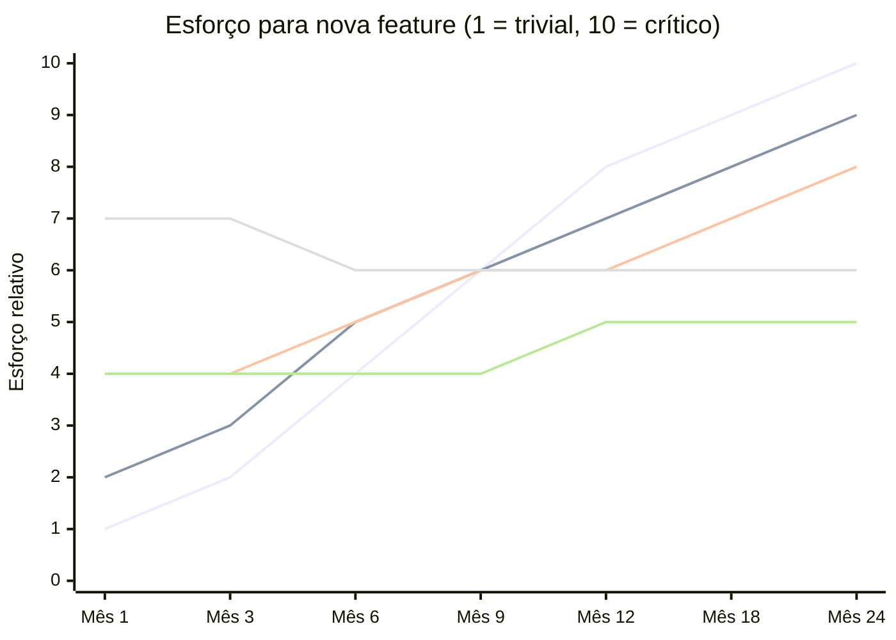
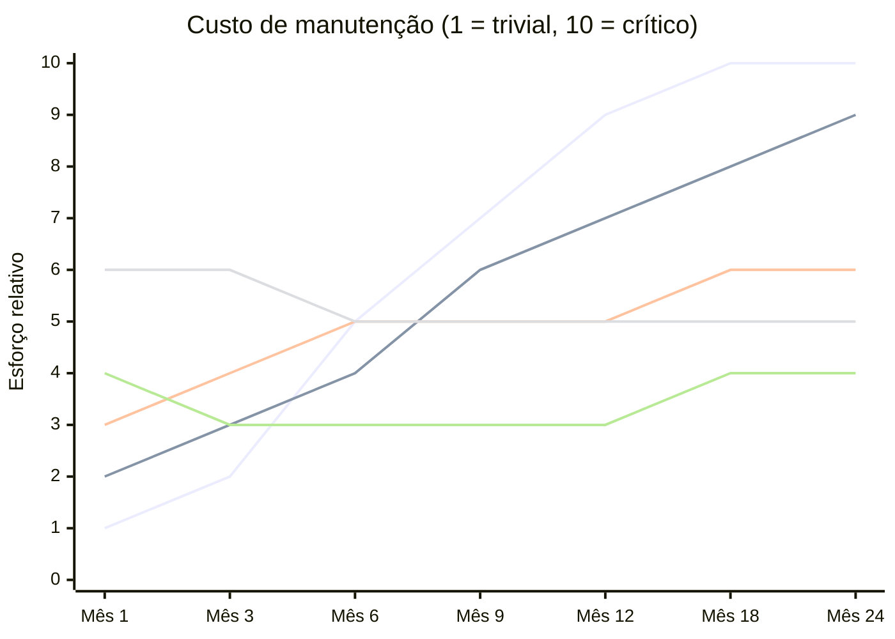

# Arquitetura — Financial Health Dashboard

## Por que a arquitetura importa neste contexto

A maioria dos projetos Flutter pequenos funciona razoavelmente com qualquer abordagem. O problema não é o MVP — é o que acontece três meses depois, quando uma segunda feature entra, um desenvolvedor sai do time, a regra de negócio muda ou você precisa escrever um teste sem inicializar a UI inteira.

A decisão arquitetural deste projeto foi tratada como decisão de produto: tomada antes da primeira linha de código, com critérios explícitos, comparando alternativas reais.

---

## Processo de decisão

Antes de escolher, foram simuladas variáveis do projeto como entrada para análise comparativa assistida por IA:

| Variável | Valor |
|----------|-------|
| Time de desenvolvimento | 2 devs front-end |
| Prazo | 3 meses |
| Número de features no MVP | 5 |
| Tipo de projeto | Dashboard de saúde financeira |
| Conexão com API externa | Sim |
| Persistência offline | Sim |
| MVP é POC descartável? | Não |
| Reuso de features em outro app? | Não |

A análise foi conduzida com assistência de IA — as variáveis acima foram usadas como entrada para uma comparação estruturada entre arquiteturas. O output foi filtrado criticamente antes de qualquer decisão: nem toda sugestão foi adotada e em alguns casos a IA errou.

→ **[Como a IA participou do processo e onde ela falhou](./ia_in_process.md)**

---

### Por que essa estrutura foi escolhida

A decisão não partiu de preferência pessoal — foi simulada antes da implementação, usando o contexto real do projeto como entrada para análise comparativa.

**Prompt de exploração arquitetural:**

```
Imagine que estamos iniciando o desenvolvimento de um novo aplicativo.
Nesse MVP temos 5 telas que se conectam a uma API REST.
A linguagem e framework adotados são Dart e Flutter.
Precisamos decidir a arquitetura do projeto.

Contexto:
- Quantos desenvolvedores? 2 front-end
- Quanto tempo? 3 meses
- Quantas funcionalidades? 5
- Tipo de projeto? Overview (Dashboard) de saúde financeira
- Conexão com API externa? Sim
- Persistência offline + Offline First? Sim
- O MVP é POC que será refatorado depois? Não
- Reutilização de funcionalidades em outro app no futuro? Não
```

A partir dessas variáveis, foram analisadas comparativamente:

- **DDD completo vs DDD pragmático** — DDD completo traz isolamento forte mas exige camadas extras (application, value objects, aggregates) sem retorno claro para 5 features em 3 meses com 2 devs. DDD pragmático mantém entidades e políticas de negócio no domínio sem a cerimônia desnecessária.
- **Clean Architecture vs FSD vs monolítica** — Clean Architecture com separação `data/domain/presentation` por feature garante testabilidade sem o custo de micro-frontends ou feature-sliced design para esse escopo.
- **Feature-first vs camadas globais** — Feature-first (agrupar por contexto funcional) foi escolhido sobre camadas globais (agrupar por tipo: todos os repositories juntos, todos os cubits juntos). Razão: menor acoplamento entre contextos, remoção de feature sem impacto transversal, onboarding mais localizado.
- **MVVM vs MVP vs MVC** — MVVM com Cubit foi escolhido sobre MVP (mais boilerplate de interface) e MVC (acoplamento entre controller e view difícil de testar). Cubit mantém estados mutuamente exclusivos (`loading`, `success`, `error`) sem a verbosidade de BLoC puro.

**Resultado:** feature-first com separação interna `data / domain / presentation`, Cubit para estado, `get_it` para DI e `go_router` para navegação.

---

### Estrutura adotada

```
lib/
└── src/
    ├── core/                         # infraestrutura compartilhada por todo o app
    │   ├── app/                      # MaterialApp, configuração de tema
    │   ├── dependencies/             # setup do get_it (injeção de dependências)
    │   ├── failures/                 # AppFailure sealed class — erros tipados
    │   ├── router/                   # configuração do go_router
    │   └── services/
    │       ├── clock/                # abstração de tempo (evita DateTime.now() espalhado)
    │       ├── http/                 # HttpService + FakeHttpService
    │       ├── network/              # verificação de conectividade
    │       └── storage/              # key-value storage (persistência da sessão)
    │
    ├── shared/                       # código de negócio compartilhado entre features
    │   ├── data/                     # modelos e parsers neutros
    │   ├── domain/                   # entidades e enums sem dono de feature
    │   │   └── enum/                 # IncomeCategory, ExpenseCategory
    │   └── presentation/             # componentes de UI compartilhados (migrados para o design system)
    │
    └── features/
        ├── dashboard/                # tela principal
        │   ├── dashboard_init.dart   # registro de DI desta feature
        │   ├── data/
        │   │   ├── datasources/      # chamadas HTTP
        │   │   ├── mappers/          # JSON → modelo
        │   │   ├── models/           # DTOs de rede
        │   │   └── repositories/     # implementações concretas
        │   ├── domain/
        │   │   ├── entities/         # DashboardOverviewData, FinancialHealthScoreData,
        │   │   │                     # FlowAnalysisData, MonthlyGoalData
        │   │   ├── enum/             # FinancialHealthStatus, MonthlyGoalStatus
        │   │   ├── policies/         # FinancialHealthScorePolicy, MonthlyGoalStatusPolicy
        │   │   ├── repositories/     # contratos (interfaces)
        │   │   └── use_cases/        # casos de uso
        │   └── presentation/
        │       ├── mappers/          # entidade → texto de UI (sem strings no domínio)
        │       ├── models/           # AddTransactionSheetResult e inputs de UI
        │       ├── view/             # DashboardView
        │       ├── view_model/       # DashboardCubit, AddTransactionCubit
        │       └── widgets/          # widgets específicos desta feature
        │
        ├── expenses/                 # tela de detalhe de despesas (estrutura espelhada)
        ├── incomes/                  # tela de detalhe de receitas (estrutura espelhada)
        └── transactions/             # lista completa de transações (estrutura espelhada)
```

**Cada feature tem um `*_init.dart`** que centraliza o registro de DI. Isso mantém o `dependencies/` do core limpo e permite que uma feature seja removida sem deixar referências soltas.

**`shared/` não é um depósito** — só entra o que é genuinamente compartilhado e semanticamente neutro. Código específico de uma feature que "reaproveita" outra feature é sinal de acoplamento, não de reuso. Os componentes visuais compartilhados migraram para o package `financial_health_design_system` — a decisão e o impacto dessa migração estão documentados em [Design System →](../design/design_system.md).

---

## Alternativas consideradas

### Comparação rápida

| Arquitetura | Setup | Testabilidade | Onboarding | Acoplamento cross-feature | Custo a longo prazo |
|---|:---:|:---:|:---:|:---:|:---:|
| Monolítica (tudo em `lib/`) | ✅ | ❌ | ✅ | ❌ | ❌ |
| Feature-first sem camadas | ✅ | ⚠️ | ✅ | ⚠️ | ⚠️ |
| Clean Arch global (`data/domain/presentation` raiz) | ⚠️ | ✅ | ❌ | ⚠️ | ⚠️ |
| Feature Sliced Design (FSD) | ❌ | ✅ | ❌ | ✅ | ✅ |
| **Feature-first + Clean interna (adotada)** | ⚠️ | ✅ | ⚠️ | ✅ | ✅ |

---

### Custo de adicionar uma nova feature ao longo do tempo

Simulação do esforço relativo para adicionar uma feature nova em cada arquitetura, mês a mês, conforme o projeto cresce. Os valores refletem o acoplamento acumulado, a localização de código e a testabilidade de cada abordagem.



**Referência de linhas** — as cores são atribuídas por ordem de declaração no gráfico:

| Ordem | Arquitetura | Mês 1 | Mês 24 | Tendência |
|:---:|---|:---:|:---:|---|
| 1 | Monolítica | 1 | 10 | ↗ piora rápido |
| 2 | Feature-first sem camadas | 2 | 9 | ↗ piora |
| 3 | Clean Arch global | 4 | 8 | ↗ piora devagar |
| 4 | FSD | 7 | 6 | → estável, mas começa alto |
| 5 ★ | **Feature-first + Clean (ADOTADA)** | 4 | 5 | → estável, começa baixo |

**Leitura:** a arquitetura monolítica começa mais simples — e isso é real, não é percepção. O problema aparece a partir do mês 6, quando o acoplamento acumulado torna cada mudança arriscada. A abordagem adotada (linha 5 ★) tem custo inicial similar ao Clean Arch global, mas se mantém estável porque cada feature é uma unidade autônoma e o domínio é testável sem UI.

---

### Custo de manutenção ao longo do tempo

Esforço relativo para corrigir um bug, ajustar uma regra de negócio ou refatorar parte de uma feature existente. Cenários considerados: corrigir cálculo de score, mudar categoria de transação, remover uma feature inteira, atualizar um use case sem quebrar outra feature.



**Referência de linhas** — as cores são atribuídas por ordem de declaração no gráfico:

| Ordem | Arquitetura | Mês 1 | Mês 24 | Tendência |
|:---:|---|:---:|:---:|---|
| 1 | Monolítica | 1 | 10 | ↗ piora rápido |
| 2 | Feature-first sem camadas | 2 | 9 | ↗ piora |
| 3 | Clean Arch global | 3 | 6 | ↗ piora devagar |
| 4 | FSD | 6 | 5 | → estável, mas começa alto |
| 5 ★ | **Feature-first + Clean (ADOTADA)** | 4 | 4 | → estável, começa e termina baixo |

**Leitura:** o custo de manutenção da abordagem adotada (linha 5 ★) começa ligeiramente mais alto porque exige disciplina de camadas desde o dia 1, mas **cai** após os primeiros meses — quando o padrão é internalizado. A partir do mês 6, é consistentemente o mais baixo. A manutenção na monolítica é inversamente proporcional: começa fácil e se torna progressivamente inviável.

> **Ponto de cruzamento:** por volta do mês 4–5, a abordagem adotada já custa menos que a monolítica em manutenção. Em implementação de novas features, esse cruzamento acontece por volta do mês 7–8.

---

### Por que cada alternativa foi descartada

| Arquitetura | Motivo principal de descarte |
|---|---|
| Monolítica | Acoplamento invisível cresce com cada feature; remoção de feature exige busca manual em toda a codebase |
| Feature-first sem camadas | `FinancialHealthScorePolicy` é regra de negócio real — sem separação de domínio ela vaza para o widget sem contrato testável |
| Clean Arch global | Adicionar ou remover uma feature toca três diretórios distintos; acoplamento entre features é invisível pela estrutura de pastas |
| FSD | Melhor steady-state do que Clean Arch global, mas começa com custo 7 (vs 4 da adotada). Para um time de 2 devs com 3 meses de prazo, a curva de aprendizado do FSD consumiria a janela inteira do projeto antes de qualquer retorno — FSD foi projetado para apps web de larga escala, e o mapeamento para Flutter mobile não é natural. Nos gráficos, a linha do FSD **começa mais cara** e só estabiliza no nível da adotada no mês 12+; a adotada chega lá no mês 3. |

---

### Abordagem escolhida: Feature-first + Clean Architecture interna

Cada feature é organizada como uma unidade coesa com separação interna em `data / domain / presentation`.

```
features/
  dashboard/
    data/
      datasources/
      mappers/
      models/
      repositories/        # implementações concretas
    domain/
      entities/
      enum/
      policies/
      repositories/        # contratos (interfaces)
      use_cases/
    presentation/
      mappers/
      models/
      view/
      view_model/
      widgets/
    dashboard_init.dart    # registro de DI desta feature
```

**Por que funciona para este projeto:**

1. **Localidade:** tudo relacionado ao dashboard está em `features/dashboard/`. Para entender ou modificar o dashboard, você não precisa sair daquela pasta.

2. **Independência:** remover a feature de `expenses` exige deletar `features/expenses/` e remover o `expenses_init.dart` do registro. Nenhum outro diretório precisa ser tocado.

3. **Testabilidade por camada:** regras de negócio como `FinancialHealthScorePolicy` e `MonthlyGoalStatusPolicy` são testadas em unidade sem nenhuma dependência de UI ou HTTP. O `DashboardCubit` é testado injetando repositórios falsos. Widgets são testados passando states prontos.

4. **Direção de dependência:** `presentation` depende de `domain`. `data` implementa contratos de `domain`. `domain` não conhece nenhuma das duas. Essa direção é verificável por imports.

---

## Princípios SOLID aplicados

### S — Single Responsibility

Cada classe tem uma única razão para mudar. O exemplo mais claro do projeto é a separação entre a entidade de domínio e o mapper de apresentação para o score financeiro.

```dart
// ❌ violação — a entidade tem duas razões para mudar:
//    a regra financeira E o copy da UI
class FinancialHealthScoreData {
  String get statusLabel => status == FinancialHealthStatus.healthy
      ? 'Saudável'
      : 'Atenção';
}

// ✅ separação real — cada classe muda por um motivo diferente
// FinancialHealthScorePolicy  → muda se a regra de cálculo mudar
// FinancialHealthScoreTextMapper → muda se o copy ou i18n mudar
class FinancialHealthScoreTextMapper {
  static String statusLabel(FinancialHealthStatus status) { ... }
  static String description(FinancialHealthScoreData data) { ... }
}
```

### I — Interface Segregation

Cada feature tem seu próprio contrato de repositório — nenhuma implementa uma interface genérica maior do que precisa.

```dart
// DashboardRepository só expõe o que o domínio do dashboard usa
abstract interface class DashboardRepository {
  Future<Either<AppFailure, DashboardOverviewData>> getOverview();
  Future<Either<AppFailure, DashboardOverviewData>> addIncome(AddDashboardIncomeInput input);
  Future<Either<AppFailure, DashboardOverviewData>> addExpense(AddDashboardExpenseInput input);
}
```

Não há um `FinancialRepository` genérico com 15 métodos dos quais cada feature usa 3. A feature de expenses tem `ExpensesRepository`, a de incomes tem `IncomesRepository` — contratos independentes que evoluem separadamente.

### D — Dependency Inversion

Módulos de alto nível dependem de abstrações, não de implementações concretas.

```dart
// O use case recebe a interface, não a implementação
class GetDashboardOverviewUseCase {
  const GetDashboardOverviewUseCase(this._repository);
  final DashboardRepository _repository; // interface

  Future<Either<AppFailure, DashboardOverviewData>> call() {
    return _repository.getOverview();
  }
}
```

O `get_it` decide qual implementação injetar (`FakeHttpService` agora, uma implementação real com `dio` depois). O use case não muda — nem sabe que existe um `FakeHttpService`.

---

## Curva de complexidade

A separação em camadas tem um custo inicial: para uma feature nova, você cria datasource, model, mapper, repository (interface + implementação), use case, state, cubit e widget. Isso é mais trabalho do que um `StatefulWidget` com `http.get` embutido.

O ponto de inversão acontece quando:

- A feature precisa de um **segundo comportamento** (ex: a tela de expenses reutiliza a lógica de categorias sem copiar código).
- A **regra muda** (ex: o cálculo do score é ajustado; o teste unitário da policy captura a regressão antes de chegar na UI).
- Um **novo dev entra** e precisa entender uma feature isolada sem ler o app inteiro.
- Você precisa **testar** sem inicializar widget tree, HTTP ou storage.

Para um projeto de 5 features em 3 meses com 2 devs, o custo inicial é pago no primeiro mês. O retorno aparece nas features 2 a 5.

---

## O que ficou fora de escopo intencionalmente

| Decisão | Por que não foi feita |
|---------|----------------------|
| Application layer (services de aplicação) | Para 5 features, a separação use case → repository já garante testabilidade sem precisar de uma camada intermediária |
| Value Objects para Money | Custo alto agora; `double` funciona para demonstrar a arquitetura, mas é dívida técnica documentada |
| Aggregates formais | DDD pragmático para este escopo; `DashboardOverviewData` serve como agregado implícito sem cerimônia |
| Eventos de domínio | Não há casos de uso que precisem propagar efeitos entre features de forma assíncrona neste MVP |

---

## Referências

- [Gerenciamento de estado →](./state_management.md)
- [Eventos efêmeros e desacoplamento →](./ephemeral_events.md)
- [Requisitos que guiaram estas decisões →](../../docs/requirements/requirements.md)
