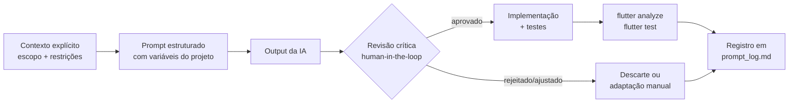

# IA no processo — uso crítico na prática

Este documento registra como a IA foi usada durante o desenvolvimento do Financial Health Dashboard: onde ela contribuiu de forma real, onde ela errou e como os erros foram detectados e corrigidos.

O objetivo não é mostrar que a IA foi usada — é mostrar que ela foi usada **com filtro**. Copiar output de IA sem revisão é risco. O ciclo adotado aqui foi diferente.

---

## O ciclo aplicado



Cada decisão relevante tem entrada no [prompt_log.md](../../../../docs/ia/prompt_log.md). Erros têm entrada adicional no [learnings.md](../../../../docs/ia/learnings.md).

---

## Onde a IA contribuiu de forma real

### 1. Decisão arquitetural: feature-first + clean interna

O contexto do projeto foi passado como tabela estruturada (time, prazo, features, tipo de projeto, descartabilidade do MVP) e a IA foi usada como ferramenta de análise comparativa — não para escolher, mas para estruturar o raciocínio.

A sugestão de `feature-first + data/domain/presentation` interno foi adotada depois de validar três critérios específicos:

- **Localidade de raciocínio**: tudo relacionado a uma feature cabe em um único diretório
- **Direção de dependência verificável por imports**: `presentation` → `domain` ← `data`, nunca o contrário
- **Testabilidade por camada sem UI**: `FinancialHealthScorePolicy` e `MonthlyGoalStatusPolicy` podem ser testadas com `dart test` puro

A alternativa de Clean Architecture com camadas globais foi descartada manualmente — não porque a IA descartou, mas porque o desenvolvedor identificou que adicionar ou remover uma feature tocaria três diretórios distintos na raiz.

---

### 2. Padrão `effectVersion` para deduplicação de efeitos efêmeros

O problema era abrir um bottom sheet via `BlocListener` sem repetir a ação se o Cubit reemitisse o mesmo estado por outro motivo.

A solução sugerida pela IA foi usar `effect` como campo nullable (`DashboardEffect?`) **em conjunto com** `effectVersion` como contador inteiro — e fazer o `listenWhen` depender apenas da versão:

```dart
// dashboard_state.dart (simplificado)
@freezed
class DashboardState with _$DashboardState {
  const factory DashboardState({
    // ... campos de dados
    DashboardEffect? effect,
    @Default(0) int effectVersion,
  }) = _DashboardState;
}

// dashboard_cubit.dart
void onAddIncomePressed() {
  emit(state.copyWith(
    effect: DashboardEffect.showAddIncomeSheet,
    effectVersion: state.effectVersion + 1, // garante nova emissão mesmo com mesmo effect
  ));
}
```

```dart
// dashboard_view.dart
BlocListener<DashboardCubit, DashboardState>(
  listenWhen: (previous, current) =>
      previous.effectVersion != current.effectVersion, // ← apenas version importa
  listener: (context, state) {
    if (state.effect == DashboardEffect.showAddIncomeSheet) {
      _handleShowAddIncomeSheet(context);
    }
  },
)
```

O insight importante aqui: sem `effectVersion`, se o usuário abrir o sheet, fechar e abrir novamente com o **mesmo** effect, o `BlocListener` não dispara — porque o valor nullable não mudou. O contador resolve o problema de deduplicação sem precisar limpar e reemitir o state.

Essa solução foi adotada integralmente. O padrão foi replicado nas features `incomes` e `expenses`.

---

### 3. Separação `FinancialHealthScorePolicy` + `FinancialHealthScoreTextMapper`

A IA sugeriu separar o **cálculo** do score (domínio) da **apresentação textual** (ex: "Saúde Boa", "Score excelente") em componentes distintos.

```dart
// ✅ domínio — só cálculo e classificação, sem string de UI
class FinancialHealthScorePolicy {
  static const double _commitmentWeight   = 0.65;
  static const double _liquidityLevelWeight = 0.25;
  static const double _liquidityTrendWeight = 0.10;

  FinancialHealthScoreComputation compute({
    required double income,
    required double expense,
    required double currentLiquidityIndex,
    required double previousLiquidityIndex,
  }) { /* ... */ }
}

// ✅ presentation — só texto, depende do status calculado pelo domínio
class FinancialHealthScoreTextMapper {
  static String headline(FinancialHealthStatus status) => switch (status) {
    FinancialHealthStatus.healthy   => 'Saúde financeira boa',
    FinancialHealthStatus.attention => 'Atenção necessária',
    FinancialHealthStatus.critical  => 'Situação crítica',
  };
}
```

A vantagem prática: `FinancialHealthScorePolicy` é testável com `dart test` puro (nenhuma dependência de Flutter ou UI). O texto pode mudar por idioma, tom de voz ou A/B test sem tocar em nenhuma regra de negócio.

---

### 4. `Clock` como abstração de infraestrutura

A IA sinalizou um problema que seria invisível até a virada do mês: `MonthlyGoalData.referenceDate` estava sendo calculado com `DateTime.now()` dentro do `toEntity()` do model.

O problema: um teste escrito às 23h58 poderia passar, mas falhar rodado novamente à meia-noite com os mesmos dados — porque a data de referência mudou entre as execuções.

A solução foi injetar o tempo como dependência de infraestrutura e passar apenas o valor de negócio para o domínio:

```dart
// core/services/clock.dart
abstract interface class Clock {
  DateTime now();
}

class SystemClock implements Clock {
  const SystemClock();
  @override
  DateTime now() => DateTime.now();
}

// data — repository recebe Clock, normaliza e passa para o domínio
class DashboardRepositoryImpl implements DashboardRepository {
  DashboardRepositoryImpl({required Clock clock, /* ... */}) : _clock = clock;
  final Clock _clock;

  @override
  Future<Either<AppFailure, DashboardOverviewData>> getOverview() async {
    final raw = await _dataSource.getOverview();
    final today = _clock.now();
    final referenceDate = DateTime(today.year, today.month, today.day);
    return raw.toEntity(referenceDate: referenceDate); // domínio recebe data, não o serviço
  }
}
```

```dart
// teste — data de referência explícita, sem comportamento fantasma
test('meta está em risco no dia 20 com progresso insuficiente', () {
  final data = MonthlyGoalData(
    referenceDate: DateTime(2026, 4, 20), // ← determinístico
    achievedPercent: 40.0,
    targetAmount: 5000,
  );
  expect(policy.resolve(data), MonthlyGoalStatus.atRisk);
});
```

---

## Onde a IA errou (e foi corrigida)

### Erro 1 — Fórmula do score financeiro travada

**Contexto:** a primeira versão da fórmula do score usava uma estrutura de bônus discreto sobre comprometimento de renda:

```dart
// ❌ versão original sugerida pela IA
double _computeScore(double income, double expense, double liquidityIndex) {
  final commitment = (income > 0) ? (expense / income) : 1.0;
  final base = ((1 - commitment) * 70).clamp(0, 70);
  // bônus discreto: salta de 0 → 15 → 30 sem variação contínua
  final bonus = liquidityIndex > 1.0 ? 30.0 : liquidityIndex > 0.5 ? 15.0 : 0.0;
  return base + bonus;
}
```

**Como o erro foi detectado:** antes da implementação, foi escrito o teste:

```dart
test('score varia ao mudar apenas o índice de liquidez', () {
  const policy = FinancialHealthScorePolicy();

  final a = policy.compute(
    income: 5000, expense: 3000,
    currentLiquidityIndex: 0.6, previousLiquidityIndex: 0.5,
  );
  final b = policy.compute(
    income: 5000, expense: 3000,
    currentLiquidityIndex: 0.8, previousLiquidityIndex: 0.5,
  );

  expect(b.score, greaterThan(a.score)); // ← falhou com a fórmula original
});
```

O teste falhou. Com a fórmula original, `liquidityIndex = 0.6` e `liquidityIndex = 0.8` caíam no mesmo bônus discreto (15), produzindo score idêntico. O score ficava "travado" em cenários onde só a liquidez variava.

**Correção:** fórmula composta com três dimensões e pesos explícitos, eliminando os saltos discretos:

```dart
// ✅ versão corrigida — score contínuo e auditável
static const double _commitmentWeight     = 0.65;
static const double _liquidityLevelWeight = 0.25;
static const double _liquidityTrendWeight = 0.10;

FinancialHealthScoreComputation compute({...}) {
  final commitmentPercent = income <= 0
      ? (expense <= 0 ? 0.0 : 100.0)
      : (expense / income) * 100;

  final commitmentScore    = (100 - commitmentPercent).clamp(0, 100).toDouble();
  final liquidityLevelScore = _liquidityLevelScore(currentLiquidityIndex); // contínuo
  final liquidityTrendScore = _liquidityTrendScore(                        // contínuo
    previousLiquidityIndex: previousLiquidityIndex,
    liquidityDelta: liquidityDelta,
  );

  final score = (
    commitmentScore    * _commitmentWeight +
    liquidityLevelScore * _liquidityLevelWeight +
    liquidityTrendScore * _liquidityTrendWeight
  ).clamp(0, 100).round();

  return FinancialHealthScoreComputation(score: score, status: _resolveStatus(score), ...);
}
```

O mesmo teste passou após a correção. Pesos e thresholds foram documentados para que qualquer ajuste futuro seja rastreável.

---

### Erro 2 — `TransactionCategory` no domínio com `label` em português

**Contexto:** em uma refatoração para unificar os bottom sheets de receita e despesa em um único componente, a IA propôs criar um enum `TransactionCategory` unificado **no domínio** — e usar o campo `.label` (string em português) como chave de serialização no repositório:

```dart
// ❌ versão sugerida pela IA
// domain/entities/transaction_category.dart  ← ERRADO: label de UI no domínio
enum TransactionCategory {
  salary, gift, investment, food, transport, shopping;

  String get label => switch (this) {
    TransactionCategory.salary    => 'Salário',       // string de UI
    TransactionCategory.food      => 'Alimentação',   // string de UI
    // ...
  };
}

// No repositório:
'category': transaction.category.label, // ❌ persiste "Salário" — quebra com i18n ou rename
```

**Por que é um erro:** `.label` é uma preocupação de apresentação — muda com idioma, tom de voz e testes A/B. Usar `.label` como chave de serialização no repositório significa que renomear "Salário" para "Renda" quebraria todos os registros já persistidos no storage. Além disso, o domínio não deveria saber que existe uma tela que unifica receitas e despesas.

**Correção:** separar os tipos no domínio, mover `TransactionCategory` para presentation e serializar pelo `.code` estável:

```dart
// ✅ domínio — tipos separados com code estável
// shared/domain/enum/income_category.dart
enum IncomeCategory { salary, gift, investment }

// shared/domain/enum/expense_category.dart
enum ExpenseCategory { food, transport, shopping }

// ✅ presentation — enum unificado para UI, com label
// shared/presentation/add_transaction/models/transaction_category.dart
enum TransactionCategory { salary, gift, investment, food, transport, shopping }

extension TransactionCategoryPresentationExt on TransactionCategory {
  String get label => switch (this) {
    TransactionCategory.salary => 'Salário',
    TransactionCategory.food   => 'Alimentação',
    // ...
  };
}

// ✅ mapper como fronteira explícita entre presentation e domínio
final class AddTransactionInputMapper {
  static AddDashboardIncomeInput toIncomeInput(AddIncomeSheetResult result) {
    return AddDashboardIncomeInput(
      amount: result.amount,
      title: result.description,
      category: _toIncomeCategory(result.category), // converte TransactionCategory → IncomeCategory
    );
  }

  static IncomeCategory _toIncomeCategory(TransactionCategory category) {
    return switch (category) {
      TransactionCategory.salary     => IncomeCategory.salary,
      TransactionCategory.gift       => IncomeCategory.gift,
      TransactionCategory.investment => IncomeCategory.investment,
      // categorias de despesa: erro em tempo de compilação se chegarem aqui
      _ => throw ArgumentError.value(category, 'category', 'Não é categoria de receita.'),
    };
  }
}
```

O domínio passou a rejeitar em compilação uma despesa categorizada como receita. A serialização no repositório passou a usar `.name` (equivalente ao `code` estável) — independente de qualquer string de UI.

---

### Menção breve: código declarado sem consumo

Em um ciclo de geração incremental, a IA produziu artefatos que nunca foram usados em nenhum widget, teste ou rota:

- `CommitmentStatus` — enum gerado para representar faixas de comprometimento de renda, nunca renderizado na UI
- Pastas `features/notifications/` e `features/settings/` criadas vazias como "preparação para o futuro"
- `Future.delayed(Duration(seconds: 2))` no `DashboardCubit.submit()` — delay artificial no ViewModel, onde não faz sentido; pertence à camada de dados

**Resolução:** remoção completa antes do commit. O princípio adotado: todo artefato declarado precisa ser consumido em pelo menos um lugar real (widget, teste ou rota) antes de entrar no repositório.

---

## O que foi descartado intencionalmente

| Sugestão da IA | Motivo do descarte |
|---|---|
| Camadas globais `data/domain/presentation` na raiz | Adicionar uma feature tocaria três diretórios; acoplamento invisível entre features |
| Feature Sliced Design (FSD) | Overhead conceitual alto para o escopo; terminologia de FSD não mapeia naturalmente para Flutter mobile |
| `shared_preferences` como wrapper de storage direto | Acoplamento com implementação concreta; substituído por interface `KeyValueWrapper` |
| Usar `BlocConsumer` no lugar de `BlocListener` + `BlocBuilder` separados | Mistura build e side-effects no mesmo widget; separação explícita é mais legível e testável |
| Injetar `Clock` diretamente na entidade de domínio | Levaria infraestrutura para o núcleo; domínio deve receber o valor (`referenceDate`), não o serviço |

---

## Boas práticas que emergiram deste processo

1. **Prompt com contexto estruturado produz output mais útil.** Passar a tabela de variáveis do projeto (time, prazo, features, descartabilidade) gerou comparação mais relevante do que "qual a melhor arquitetura para Flutter".

2. **Testes antes da implementação detectaram erros da IA que revisão manual teria deixado passar.** O score travado só foi encontrado porque o teste foi escrito primeiro.

3. **A IA não tem visão de camadas.** Ela otimiza para reduzir duplicação de código, mas não necessariamente para manter fronteiras arquiteturais. O caso de `TransactionCategory` no domínio é um exemplo direto disso.

4. **Código morto gerado incrementalmente é silencioso.** A IA não sabe o que está fora de escopo. Revisão manual de `import` e referências antes de cada commit preveniu acúmulo de artefatos não usados.

5. **Registrar erros no momento em que acontecem.** Entradas no `learnings.md` escritas durante o desenvolvimento têm mais precisão do que reconstruções posteriores.

---

## Referências

- [Prompt log completo →](../../../../docs/ia/prompt_log.md)
- [Learnings e memória de erros →](../../../../docs/ia/learnings.md)
- [Regras de uso de IA →](../../../../docs/ia/rules.md)
- [Decisão arquitetural →](./architecture.md)
